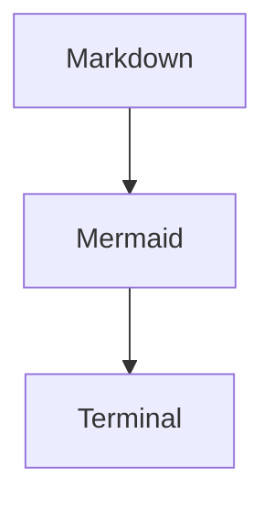

---
id: title
layout: title
title: Breeze
subtitle: Slide decks from frontmatter and Markdown
speaker: Gazler
footer: Struct decks still work too
---
<!--
This deck is loaded from examples/markdown_slides.md.
-->
---
id: why
layout: bullets
title: Why Markdown?
---
- Decks are easier to scan and edit as prose.
- Slide metadata stays close to the content it controls.
- Existing Elixir struct decks continue to work unchanged.
---
id: markdown
layout: markdown
title: Plain Markdown
---
# Plain Markdown

This slide renders with `Breeze.Markdown`.

- Headings
- Paragraphs
- Bullet lists

---
id: split
layout: two-cols
title: Split Content
---
# Runtime pieces

- A Breeze.View owns state and events.
- Breeze.Server handles terminal IO and resize.
- Markdown slots map onto the existing split layout.

::right::

# Image slot

---
id: code
layout: code
title: File-backed Code
language: elixir
path: counter.ex
focus: [10..19, 21..27]
steps: 2
---
---
id: counter_demo
layout: breeze
title: Counter Demo
view: Counter
disable-transitions: true
---
